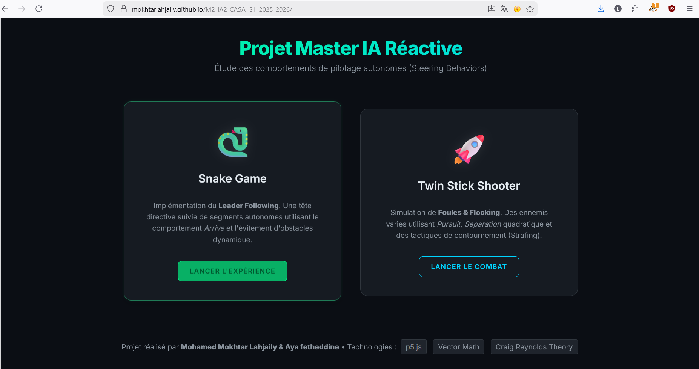
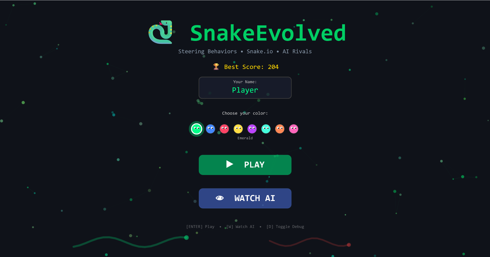
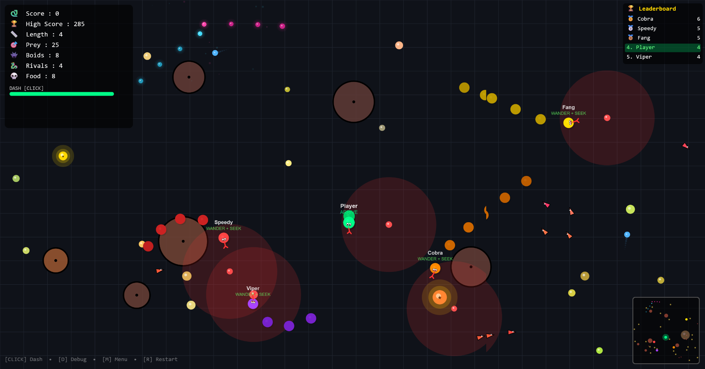
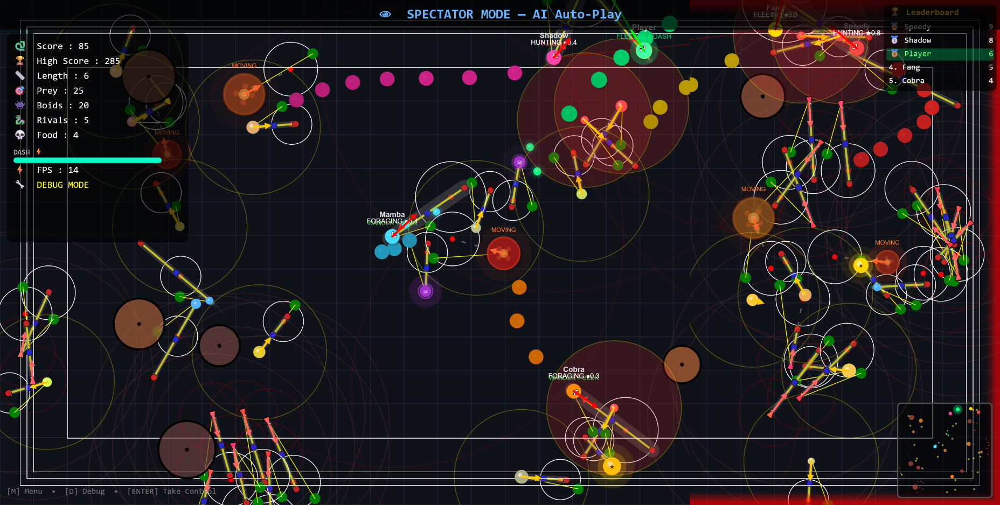
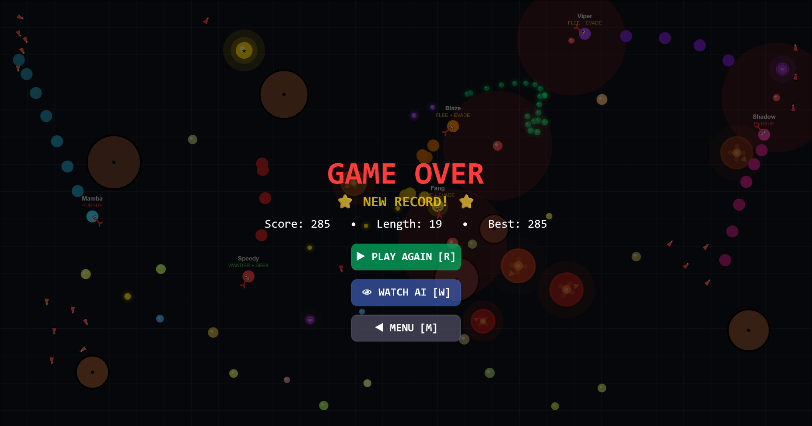
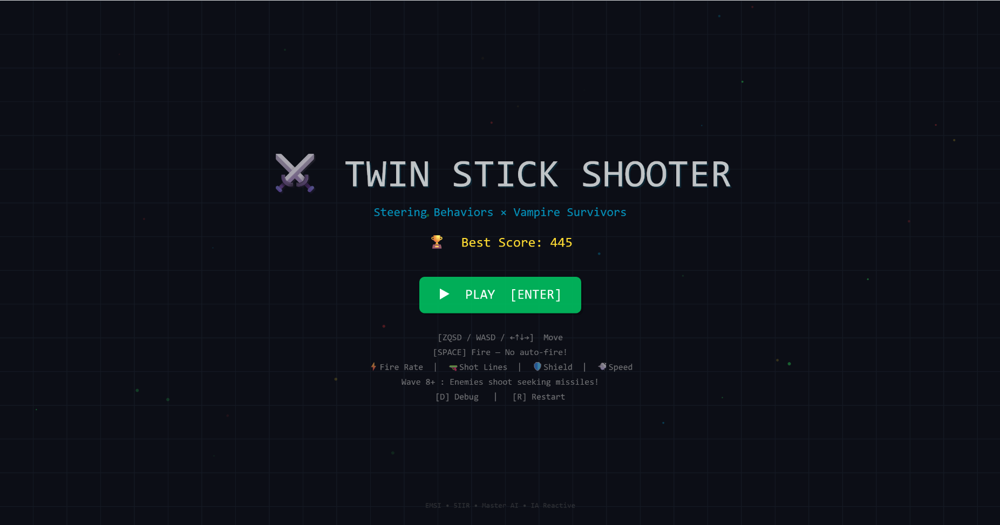
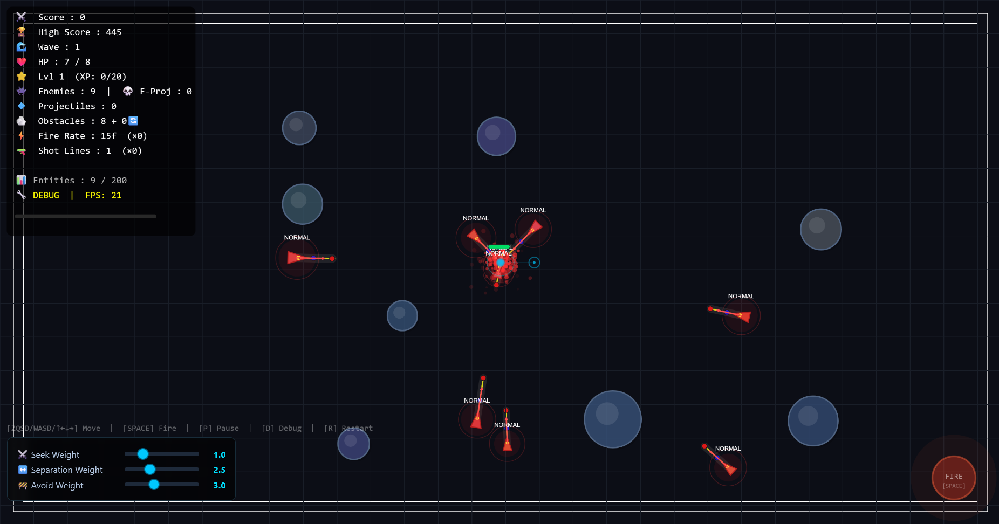
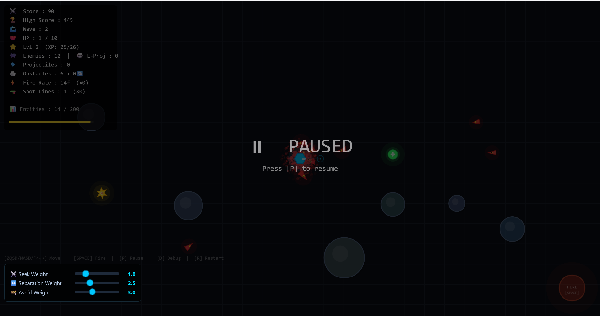
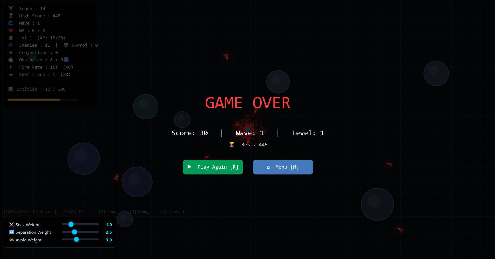

# 🎮 Projet IA Réactive — Steering Behaviors


> **Exploration des algorithmes de Steering Behaviors de Craig Reynolds** à travers deux jeux complets développés en **p5.js**, intégrant seek, arrive, flee, pursue, evade, wander, avoid, separation, alignment, cohesion et leader following.

---

## 👥 Auteurs

| Nom | Rôle |
|---|---|
| **Mohamed Mokhtar Lahjaily** | Développeur & Game Designer |
| **Aya Fetheddine** | Développeuse & Game Designer |

**Cours** : Master 2 IA — IA Réactive / Steering Behaviors (CASA G1, 2025-2026)

---

## 🚀 Démo Jouable

<div align="center">

### 🕹️ [**▶ JOUER MAINTENANT**](https://mokhtarlahjaily.github.io/M2_IA2_CASA_G1_2025_2026/) 🕹️

</div>

---

## 🎬 Vidéo de Démonstration

[](https://www.youtube.com/watch?v=0rY9ASOe_vo)

---

## 📦 Les Deux Jeux

### 🐍 SnakeEvolved — Snake.io avec Steering Behaviors

Un jeu de serpent compétitif inspiré de Snake.io où **chaque entité est un agent autonome** :
- Le serpent du joueur utilise le **Leader Following** : la tête suit la souris via `arrive()`, et chaque segment du corps suit le précédent.
- **6 serpents rivaux IA** avec personnalités différentes (agressivité, perception, vitesse).
- **Proies autonomes** qui fuient les prédateurs via `evade()` et `wander()`.
- **Boids ennemis** implémentant le flocking complet (alignment + cohesion + separation).
- Mode **Watch AI** pour observer l'IA jouer avec tous les comportements.

📖 [Documentation complète & contrôles](SnakeGame/rules.md)

### 🎯 TwinStickShooter — Vampire Survivors avec Steering Behaviors

Un shooter de survie face à des hordes intelligentes :
- **7 types d'ennemis** avec comportements distincts (seek, pursue, flanking, flee+shoot, teleport).
- **Projectiles intelligents** : de vrais `Vehicle` avec `pursue()` et `avoid()`.
- **Sliders HTML temps réel** pour modifier les poids des comportements pendant la partie.
- Progression par vagues avec difficulté croissante.

📖 [Documentation complète & contrôles](TwinStickShooter/rules.md)

---

## ✅ Architecture Technique — Conformité aux Consignes

### Comportements de Craig Reynolds implémentés

| Comportement | SnakeEvolved | TwinStickShooter | Cours (Reynolds) |
|---|:---:|:---:|---|
| **Seek** | ✅ | ✅ | Déplacement vers une cible |
| **Arrive** | ✅ | ✅ | Décélération à l'approche |
| **Flee** | ✅ | ✅ | Fuite d'une menace |
| **Pursue** | ✅ | ✅ | Interception prédictive |
| **Evade** | ✅ | ✅ | Esquive prédictive |
| **Wander** | ✅ | ✅ | Mouvement d'exploration organique |
| **Avoid Obstacles** | ✅ | ✅ | Contournement via ahead vectors |
| **Boundaries** | ✅ | ✅ | Rester dans les limites |
| **Separation** | ✅ | ✅ | Espacement entre agents |
| **Alignment** | ✅ (Boids) | — | S'aligner avec les voisins |
| **Cohesion** | ✅ (Boids) | — | Se rapprocher du centre du groupe |
| **Leader Following** | ✅ | — | Segments suivent le leader |

### Consignes spécifiques vérifiées

- ✅ **Suivi de leader (Leader Following)** : Implémenté dans `Snake` et `SnakeRival` — chaque segment du corps est un `Vehicle` indépendant utilisant `arrive()` sur le segment précédent (architecture documentée page 50 du PDF de cours).

- ✅ **Évitement d'obstacles dynamiques** : Classe `MovingObstacle` dans les deux jeux — des obstacles qui `wander()` sur la carte et que tous les agents contournent via `avoid()`. Les obstacles apparaissent/disparaissent dynamiquement pour varier le terrain.

- ✅ **Wander** : Utilisé par les proies, les obstacles mobiles, les rivaux en exploration, et l'IA auto-play. Implémentation fidèle avec cercle projeté devant le véhicule (`distanceCercle`, `wanderRadius`, `wanderTheta`).

- ✅ **Séparation** : Les ennemis du TwinStickShooter utilisent `separate()` pour ne pas se chevaucher (effet de masse réaliste). Les boids du SnakeGame utilisent `flockSeparation()`. Les obstacles mobiles utilisent `separateFromObstacles()`.

- ✅ **Flocking (Boids)** : `EnemyBoid` dans SnakeEvolved implémente les 3 règles classiques — `align()`, `cohesion()`, `flockSeparation()` — avec des poids configurables.

- ✅ **Réglage des poids en temps réel** : Le TwinStickShooter propose des **sliders HTML** pour ajuster `seekWeight`, `separationWeight` et `avoidWeight` pendant le jeu.

- ✅ **Mode Debug** : Touche `D` dans les deux jeux — affiche les vecteurs de force, rayons de perception, zones d'évitement et FPS.

### Structure de classes

```
Vehicle (classe de base commune aux deux jeux)
│   Propriétés : pos, vel, acc, maxSpeed, maxForce
│   Méthodes   : seek(), arrive(), flee(), pursue(), evade(),
│                wander(), avoid(), separate(), boundaries()
│
├── SnakeEvolved
│   ├── Snake          → Leader Following (arrive chaîné)
│   ├── SnakeRival     → IA complète (seek, pursue, flee, wander, avoid, arrive)
│   ├── EnemyBoid      → Flocking (align + cohesion + separation + flee)
│   ├── Prey           → wander + evade + avoid
│   │   ├── BonusPrey
│   │   ├── PoisonPrey
│   │   └── FleeingPrey
│   ├── Obstacle       → Statique
│   └── MovingObstacle → wander + boundaries + separate
│
└── TwinStickShooter
    ├── Player          → Contrôle clavier + avoid + boundaries
    ├── Enemy (7 types) → seek/pursue/flee/arrive + separate + avoid
    ├── Projectile      → seek + pursue + avoid (véhicule-missile)
    ├── EnemyProjectile → seek + avoid (missile ennemi homing)
    ├── Obstacle        → Statique
    ├── MovingObstacle  → wander + boundaries + separate
    └── GameManager     → Orchestrateur (spawn, vagues, sliders, score)
```

---

## 🖼️ Galerie

### Page d'accueil principale


> *Hub de sélection des deux jeux avec design futuriste.*

---

### 🐍 SnakeEvolved

| Capture | Description |
|---|---|
|  | **Menu principal** — Choix du nom, sélection du skin, boutons Play et Watch AI. |
|  | **Gameplay** — Le serpent du joueur (vert) affronte des rivaux IA colorés, des proies et des boids. HUD complet avec score, longueur, barre de dash. |
|  | **Mode Debug** — Visualisation des vecteurs de force, rayons de perception des boids, zones d'évitement des obstacles. Preuve de l'implémentation des steering behaviors. |
|  | **Game Over** — Affichage du score final avec options de restart, Watch AI ou retour au menu. |

---

### 🎯 TwinStickShooter

| Capture | Description |
|---|---|
|  | **Menu principal** — Écran d'accueil avec animation de particules. |
|  | **Gameplay** — Le joueur (hexagone bleu) affronte la horde d'ennemis multicolores. Projectiles intelligents, obstacles, power-ups. Sliders de poids visibles en bas à gauche. |
|  | **Mode Debug** — Vecteurs de vélocité et de steering visibles sur chaque ennemi. Zones d'évitement des obstacles affichées. Rayons de perception des agents. |
|  | **Pause** — Menu de pause avec statistiques de la partie en cours. |
|  | **Game Over** — Résumé de la partie avec vague atteinte, score et ennemis éliminés. |

---

## 🛠️ Technologies

- **[p5.js](https://p5js.org/)** — Bibliothèque de dessin et d'animation
- **p5.sound** — Effets sonores et musique de fond
- **HTML5 / CSS3** — Interface et sliders de réglage
- **Vanilla JavaScript** — Aucun framework externe, architecture objet pure
- **GitHub Pages** — Hébergement de la démo jouable

---

## 📚 Références

- **Craig Reynolds** — [Steering Behaviors For Autonomous Characters](https://www.red3d.com/cwr/steer/) (GDC 1999)
- **Cours de M. Buffa** — Master 2 IA, CASA G1 (2025-2026)
- **Daniel Shiffman** — *The Nature of Code* — Chapitre 6 : Autonomous Agents
